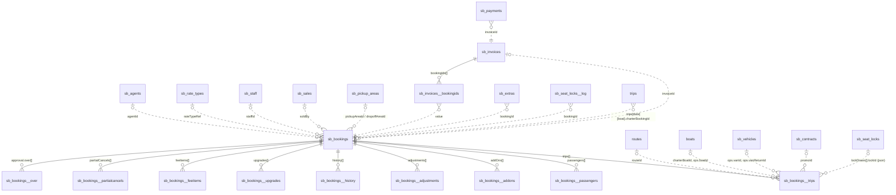
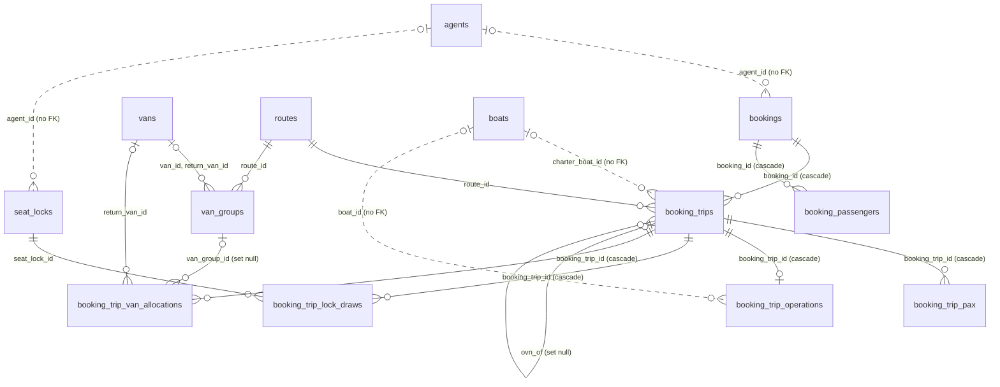

# Booking entities and relationships

- **Revised 2026-09-30:** removed the citations of `operation-backend/docs/schema.dbml`, which was deleted as stale.

- **Scope:** the booking record and every entity it references or that references it. This is an
  entity-relationship reference for later booking ports. It is not a screen port, so it has no style
  or component plan.
- **Legacy sources:** `data-model/tables/sb_bookings.js` (the persisted shape),
  `bkV2CommitBooking` (`allotment_v2/js/booking.js:12457`, the only full writer), `server.js` (B2C sync).
- **Backend sources:** `operation-backend@6afb049`, `migrations/001–017`, `src/domain/postgres-operations.ts`,
  `src/routes/operations.ts`.
- **Already ported (read-only):** `apps/web/src/features/bookings/` (`BookingsView`, `ByTripView`,
  `BookingDetailView`, van mode). Related specs: [seat-locks.md](seat-locks.md), [rate-types.md](rate-types.md),
  [agents.md](agents.md), [van-mode.md](van-mode.md).
- **Date:** 2026-09-30

---

## 1. Legacy model (allotment_v2 → Postgres `operation_schemas`)

### 1.1 Diagram

Solid lines are real foreign keys in `data-model` (child tables only). Dotted lines are **ids held in a
text column with no constraint**; nothing checks that the target exists.



### 1.2 The booking and its child tables

`sb_bookings` has one row per booking, keyed by `id` (text) (`data-model/tables/sb_bookings.js:6`).
It has ~150 flat columns: nested objects are flattened as `<object>_<field>`, e.g. `cancellation_*`,
`approval_*`, `paymentsnapshot_*`, `pricebreakdown_*`, `weatherresolve_*`. It also holds **the day-1
dispatch block** `ops_*` (`sb_bookings.js:69,81-84,89,120-121,146-150`).

Every child table is keyed by `row_pk` and ordered by `idx`, and has an FK `sb_bookings_id → sb_bookings.id`.
`/api/save` rewrites the whole array, so the child rows have no stable identity of their own.

| Table | Cardinality | Holds | `file:line` |
|---|---|---|---|
| `sb_bookings__trips` | 1 : 1..n | One departure: `routeid`, `date`, `zone`, the pax grid (`pax_{ad,chd,inf,foc}_{fr,th}`), `bookingmode`, charter fields, overnight fields, lock draws, **per-day `ops_*`** for day 2+, `promoid`, `subtotal` | `sb_bookings.js:172-229` |
| `sb_bookings__passengers` | 1 : 0..n | Name list: `name`, `nationality`, `type`, `foc` | `:158-170` |
| `sb_bookings__addons` | 1 : 0..n | `type`, `label`, `amount`, `qty`, `note`, `jad`/`jchd` (longtail-join heads) | `:230-246` |
| `sb_bookings__adjustments` | 1 : 0..n | Discounts/extras: `kind`, `mode`, `value`, `label` | `:328-341` |
| `sb_bookings__history` | 1 : 0..n | Audit log: `at`, `kind`, `text`, `tag`, `by` (written by `bkV2AddHistory`, `booking.js:3807`) | `:247-260` |
| `sb_bookings__upgrades` | 1 : 0..n | On-tour upsells: price, commission, settlement, `slips` | `:262-285` |
| `sb_bookings__feeitems` | 1 : 0..n | Change/cancel fees | `:287-299` |
| `sb_bookings__partialcancels` | 1 : 0..n | Pax removed from one trip (`tripidx`), charged/waived, refund | `:301-326` |
| `sb_bookings__over` | 1 : 0..n | Over-cap detail behind `approval.status='pending'`: `routeid`, `date`, `need`, `capfree`, `licfree` | `:343-358` |

**JSON-text columns** hold a structure with no table: `altpickups`, `attachments`, `paymentslips`,
`doccheck`, `incomplete`, `pierpayments`, `b2coverride`, `specialmeals_allergylist`, `approval_over`
(a duplicate of `sb_bookings__over`), and on trips `lockdraws`, `lockdrawsel`, `ops_vansplits`,
`ops_boatsplits`, `ops_reconfirm`, `ops_vancheckin`, `ops_piercheckin`, `ops_piernote`
(`sb_bookings.js:137-155, 209-224`).

### 1.3 Outgoing references (booking → other entity)

None of these is enforced. Each is a text id that the client resolves with a `find()`.

| Booking field | Target | Resolver | Notes |
|---|---|---|---|
| `agentId` | `sb_agents.id` | `sbGetAgent` (`08-app.js:1214`) | Required unless the booking is B2C (`booking.js:12538`). The staff agent (`code==='STAFF'`/`a_staff`) turns `purpose` into `staff_welfare`/`staff_inspection` (`booking.js:12879`). |
| `rateTypeRef` | `sb_rate_types.id` | `booking.js:12722` | Required unless `priceMode==='manual'` (`booking.js:12544`). One per booking. The per-trip rate is `trips[].rtRef`, which **has no column** (see §1.6). |
| `staffId` | `sb_staff.id` | quota check at `booking.js:12522-12529` | Only for staff bookings. |
| `soldBy` | `sb_sales` (code) | — | Salesperson credit override (`booking.js:12876`). |
| `pickupAreaId`, `dropoffAreaId` | `sb_pickup_areas.id` | `bkV2GetArea` (`booking.js:7`) | `pickupArea`/`pickupZone`/`dropoffArea` are **name/zone snapshots** taken at save (`booking.js:12767-12774`). `altPickups[].areaId`/`dropAreaId` point at the same table from inside JSON. |
| `invoiceId` | `sb_invoices.id` | set by `acctCreateInvoice` (`accounting.js:50`), cleared at `accounting.js:81` | Duplicates `sb_invoices__bookingids` in the other direction (§1.4). |
| `marketSnapshot.agentId`, `.market`, `.sub` | `sb_agents`, `sb_markets` | — | Snapshot, never recomputed. |
| `trips[].routeId` | `routes.id` | `getRoute` (`04-data-core.js:571`) | The seat-pool key, with `date`. |
| `trips[].charterBoatId` | `boats.id` | — | Charter only. Mirrored into `ops.boatId` by `bkV2CharterBoatHeal` (`booking.js:1961`). |
| `ops.boatId`, `trips[].ops.boatId` | `boats.id` | read via `bkOpsRead`/`bkOpsFor` (`booking.js:1918,1925`) | Day 1 sits on the booking, day 2+ on the trip. |
| `ops.vanId`, `ops.vanReturnId` (+ `trips[].ops.*`) | `sb_vehicles.id` | `vehGet` (`vans.js:75`) | `vanGroup`/`vanSeq` are numbers with no group entity; a group exists only as bookings sharing `(date, route, zone, vanGroup)`. |
| `trips[].lockDraws[].lockId` (JSON) | `sb_seat_locks.id` | written at `booking.js:13088-13106` | `lockDrawSel` is the staff pick, `lockDraws` what was actually drawn. `seatSource` summarises locked vs general. |
| `trips[].promoId` | `sb_contracts.id` | `laPromoFor` → `laPromoList` (`08-app.js:8583,8539`) | The promotion that priced the trip. NULL = none, or sold before migration 029. |
| `trips[].ovnOf` | another trip of the same booking | §ovnSync, `booking.js:12885` | Links an overnight return leg to its outbound leg (text, no FK). |

### 1.4 Incoming references (other entity → booking)

| Entity | Field | Cardinality | Writer / reader |
|---|---|---|---|
| `sb_invoices__bookingids` | `value` = booking id | invoice 1 : n bookings | `acctCreateInvoice` (`accounting.js:39-50`). A booking has **both** `invoiceId` and a row here; the two are kept in step by hand. |
| `sb_payments` | `invoiceId` | payment → invoice, **not** booking | A payment reaches a booking only through its invoice. |
| `sb_extras` | `bookingId`, `tripDate` | booking 1 : n extras | Pier/on-tour extra services (`booking.js:3609`). |
| `sb_seat_locks__log` | `bookingId` | lock 1 : n log rows | Draw/return audit. Lock usage (`used`, `usedBy`) is a **counter on the lock**, not derived from bookings (`bkV2DrawLock`, `booking.js:188`). |
| `trips` (legacy boat plan) | `b<N>_charterbookingid` | one charter booking per boat per day | `booking.js:1860,13131`. One column per boat (`b1…b15`), so adding a boat needs a column. |
| `travel_sum`, `ts_cot` | map key `date::bookingId` | booking×day 1 : 0..1 | `_tsKey` (`accounting.js:329`). Travel-summary decision and cash-on-tour settlement. |
| `vanjob_sreq` | map key = booking id | 1 : 0..1 | Van-sheet special-request override (`vans.js:1255`). |
| `pier_sheet` | `rows[]` per booking inside JSON under key `date::boatId` | — | Per-boat pier stock sheet (`data-model/tables/pier_sheet.js`). |

**Not booking links, despite the name:** `po_cash_pk.bid` / `po_cash_lt.bid` is a **boat** id
(`boatjob.js:394`), and `vanjob_driver` is keyed `date::vanId` (`vans.js:1401`).

### 1.5 Relationships that exist only in code

- **Seat consumption** = Σ trip pax over `(routeId, date)`, excluding cancelled statuses, charter
  trips, charter overnight return legs, over-cap `pending_approval`, and no-show/CXL-at-pier heads
  (`getSeatsConsumed`, `04-data-core.js:8581`; `bkPendHoldsSeat`, `:8553`; `bkIsCharterOvnLeg`, `:8574`;
  `ckLostByType`, `checkin.js:34`).
- **Boat load** = bookings whose `bkOpsRead(b, date).boatId` is the boat (`flBoatBookingsFor`, `04-data-core.js`).
- **B2C channel.** `b2cChannel` points at `SB_B2C`, a hard-coded list (`08-app.js:743`), and has
  **no column**. The B2C sync gives synced bookings ids of the form `b2c_<extId>(_n)` (`server.js:1404`).

### 1.6 Fields the client writes that have no column

`os_repo` saves only modelled columns, so these are **lost on the next `/api/load`**:

| Field | Written at | Effect |
|---|---|---|
| `trips[].rtRef` | `booking.js:12838` | The per-trip rate set (season) is gone after reload. Also noted in [rate-types.md](rate-types.md). |
| `paxType` | `booking.js:12792` | operation-backend has `pax_type`; legacy never stored it. |
| `specialMeals.pierAt`, `.pierBy` | `booking.js:12798` | Who logged the allergy at the pier is lost. |
| `b2cChannel` | form only | Not on `newBk` at all. |
| `sb_seat_locks.usedBy` | `booking.js:193-196` | Per-day usage of month/bulk locks. See [seat-locks.md](seat-locks.md). |

### 1.7 Legacy server rules on bookings

The server does not validate booking writes from `/api/save`. The only server-side booking logic is the
B2C sync (`server.js:1396-1640`):

- A B2C booking removed upstream is set to `cancelled` (`server.js:1402-1408`).
- On upsert, `status` never leaves a cancelled state, takes a cancel from B2C, and is kept when
  `approval_status='approved'` (`server.js:1548-1553`).
- Money columns always follow B2C (`B2C_NO_OVERRIDE`, `server.js:1541-1544`). Every other column is kept
  if its name is listed in the booking's `b2coverride` JSON (`server.js:1547,1556`).
- Trip `ops_*` columns are saved before the trips are deleted and re-inserted, then restored by `idx`
  (`server.js:1591-1614`). This depends on trip order being stable.

---

## 2. operation-backend model (migrations 001–017)

Built from `migrations/001–017` (`docs/schema.dbml` was removed on 2026-09-30 because it had stopped at migration 011).



| Table | Key | Links | Source |
|---|---|---|---|
| `bookings` | `id` | `agent_id`, `rate_type_ref`, `staff_id`, `sold_by`, `pickup_area_id`, `dropoff_area_id`, `market_agent_id`: text, no FK. `external_id` unique when set. | migration 011 |
| `booking_trips` | `id` = `trip_<booking>_<seq>` | FK `booking_id` (cascade), FK `route_id` (008), `charter_boat_id` (no FK; CHECK: only when `booking_mode='charter'`), `ovn_of` → `booking_trips.id` | migrations 008, 014, 015 |
| `booking_trip_pax` | `(booking_trip_id, category, residency)` | FK trip (cascade). The only definition of trip pax. | `migrations/` |
| `booking_passengers` | `(booking_id, seq)` | FK booking (cascade) | migration 012 |
| `booking_trip_operations` | `booking_trip_id` (1:1) | `boat_id` (no FK), `pickup_time_final`, `return_same_van`, `pier_checkin`, `reconfirm_*`, `upgrade` | migrations 013, 016 |
| `booking_trip_lock_draws` | `(booking_trip_id, seat_lock_id)` | FK trip (cascade), **FK `seat_locks.id`** | migration 014 |
| `booking_trip_van_allocations` | `(booking_trip_id, idx)` | FK trip (cascade), FK `van_groups` (set null), FK `vans` (return). idx 0 = main part; `alt_pickup` rows carry the pick/drop area | migration 016 |
| `van_groups` | `id` | FK route, FK vans; unique `(service_date, route_id, number)` | migration 016 |

What changes compared with legacy:

- **Every day is a trip row.** The day-1 vs day-2+ split of `ops` (`bkOpsRead`) goes away:
  `booking_trip_operations` is 1:1 with every trip.
- **A van group is an entity** (`van_groups`) instead of a shared number, and `vanSplits` + `altPickups`
  become `booking_trip_van_allocations` rows.
- **Lock draws are a join table with a real FK.** Lock usage is derived from it, not counted
  (`drawn_pax`, see [seat-locks.md](seat-locks.md)).
- **Pax is a 4×3 grid of rows** (`category` × `residency` `unknown|foreign|thai`) instead of the eight
  `pax_*_{fr,th}` columns plus `pax_ad`/`pax_foc`.
- **FKs are still missing** from `bookings.agent_id` to `agents` (the table exists since 017) and from
  trip/ops `boat_id` to `boats`.

---

## 3. Legacy → backend mapping

Sources for "In `ob.ts`?": `apps/web/src/lib/ob.ts:66-118` (`ObTrip`, `ObPassenger`, `ObBooking`).
The backend serialises trips at `src/domain/postgres-operations.ts:47-52`.

| Legacy entity / field | Backend | In `ob.ts`? | Status |
|---|---|---|---|
| `sb_bookings` header scalars (lead, pickup, dropoff, guides, meals counts, cash on tour, price breakdown, payment/market snapshot, lifecycle) | `bookings.*` (migration 011) | yes (`ObBooking`) | ready (read). PATCH only amends `booking_mode`, `status`, `updated_at` (`todo/booking-model.md`, stage 2 step 2). |
| `trips[]`: `routeId`, `date`, `bookingMode`, pax grid | `booking_trips` + `booking_trip_pax` → `trips[].pax`, `pax_total` | yes | ready |
| `trips[].charterBoatId` | `booking_trips.charter_boat_id` | yes | ready |
| `trips[].zone`, `pickupTime`, `ovn`, `ovnReturnDate`, `ovnLeg`, `ovnOf` | `booking_trips.*` (015), serialised | **no** | backend-only: add `zone?`, `pickup_time?`, `ovn?`, `ovn_return_date?`, `ovn_leg`, `ovn_of?` to `ObTrip` |
| `trips[].lockDraws` | `booking_trip_lock_draws` → `trips[].lock_draws[{lock_id, qty}]` | **no** | backend-only: add `lock_draws: {lock_id: string; qty: number}[]` to `ObTrip` |
| `trips[].lockDrawSel`, `seatSource` | — | — | derivable: `seatSource.locked = Σ lock_draws.qty`, `general = pax_total − locked` (replaces `booking.js:13104-13106`). `lockDrawSel` is form state only. |
| `passengers[]` | `booking_passengers` | yes | ready |
| `ops.*` / `trips[].ops.*` (boat, pickup time final, reconfirm, pier check-in) | `booking_trip_operations` (not in the booking response) | no | missing from the booking read (see §4) |
| `ops.vanId/vanReturnId/vanGroup/vanSeq/vanSplits`, `altPickups` | `van_groups` + `booking_trip_van_allocations` via the van board | yes (`ObVanBoard`) | ready for van mode; not on the booking record |
| `addOns[]`, `adjustments[]`, `attachments`, `specialMeals.allergyList`, `approval` + `over[]` | planned: `booking_addons`, `booking_adjustments`, `booking_attachments`, `booking_special_meal_allergies`, `booking_approvals` (`todo/booking-model.md` stages 2-4) | no | missing |
| `history[]`, `upgrades[]`, `feeItems[]`, `partialCancels[]`, `reschedule`, `rebook`, `cancellation.*`, `weatherResolve`, `docCheck`, `editLock`, `pierPayments`, `paymentSlips`, `b2cOverride` | — | no | missing. `POST /v1/bookings/:id/partial-cancel` and `/reschedule` change the trips but keep **no record** of the change (`routes/operations.ts:305-320`) |
| `invoiceId`, `paymentStatus`, `sb_invoices`, `sb_payments` | — | no | missing (accounting domain) |
| `sb_extras` | — | no | missing |
| `trips[].promoId`, `trips[].rtRef` | — | no | missing (`rtRef` is not even stored in legacy) |
| `agentId` → agent | `bookings.agent_id` + `GET /v1/agents/:id` | yes | ready (join client-side) |
| `pickupAreaId` → area | — | no | missing: there is no area catalogue (`todo/booking-model.md:289`) |
| `purpose`, `staffId`, `soldBy` | `bookings.*` | yes | ready. `sales_people` exists (017), `GET /v1/sales` |

---

## 4. Missing endpoints (hand-off to operation-backend)

These are drafts only. The tables they need are already planned in `todo/booking-model.md`.

### `GET /v1/bookings/:id` — include trip operations

- **Change:** add `operations` to each trip, from `booking_trip_operations`.
- **Response (trip excerpt):**
  ```json
  { "id": "trip_bk1_0", "seq": 0, "route_id": "r3", "service_date": "2026-10-02",
    "operations": { "boat_id": "b6", "pickup_time_final": "07:10", "return_same_van": false,
                    "pier_checkin": null, "reconfirm_status": "ok", "reconfirm_at": "2026-10-01T09:12:00Z" } }
  ```
- **Rule:** replaces `bkOpsRead(b, date)` (`booking.js:1918`). The day-1 special case goes away.

### Booking sub-resources (stages 2-4)

`GET` embedded in the booking, written through `PATCH /v1/bookings/:id` with "write only what changed"
(see [../partial-updates.md](../partial-updates.md)):
`addons[]`, `adjustments[]`, `approval` (+ `over[]`), `special_meal_allergies[]`, `attachments[]`.
Each maps 1:1 onto the legacy child table or JSON column listed in §1.2.

### `GET /v1/bookings/:id/history`

- **Response:** `{ "history": [{ "at": "…", "by": "…", "kind": "status", "text": "…", "tag": "…" }] }`
- **Rule:** the audit trail `bkV2AddHistory` writes today (`booking.js:3807`). Cancel, partial-cancel and
  reschedule should append to it, since they currently leave no trace.
- **Tables:** new `booking_history (booking_id FK, seq, at, by, kind, text, tag)`.

---

## 5. Rules the port must keep

- Cancelled statuses `cancelled`, `cancelled_weather`, `rejected` release seats and are left out of every
  aggregate. Backend: `SEAT_RELEASING_STATUSES` (`src/domain/booking-status.ts:29`).
- An over-cap `pending_approval` holds no seat. Legacy `bkPendHoldsSeat` (`04-data-core.js:8553`),
  backend `pendingApprovalHoldsSeats` (`booking-status.ts:42`).
- A charter takes the whole boat and is left out of the seat pool; its overnight return leg takes no seat.
- Per-date dispatch is read per trip, never from day 1 (`bkOpsFor`).
- Snapshots (`pickup_area`, `market*`, `payment_*`, `total`) are never recomputed from the current
  catalogue.
- A booking without `agent_id` is B2C/direct; B2C money columns belong to the B2C system (`server.js:1541`).

## 6. Open questions

1. Should `bookings.agent_id` get an FK to `agents` now that 017 has created the table? Legacy holds
   ids such as `a_b2c`, so check for orphans first.
2. Is `trips[].rtRef` needed? It is written but never persisted (§1.6), so every stored booking has lost
   it. Either add a column in both systems or drop it from the form.
3. Invoices link to bookings in both directions in legacy (`invoiceId` plus `bookingIds[]`). The backend
   should keep one direction, most likely `invoice_bookings (invoice_id, booking_id)`.
4. There is no maintained schema diagram in operation-backend now that `docs/schema.dbml` is gone. If one is wanted, generate it from a migrated database rather than by hand.
